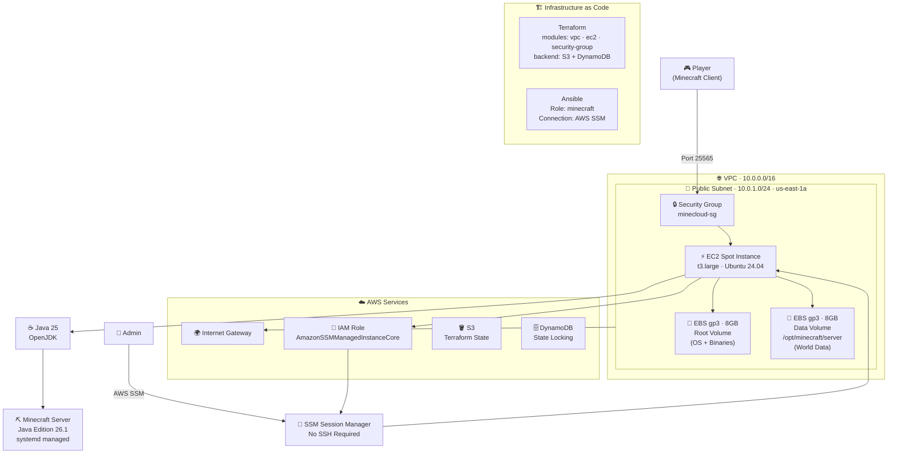

# MineCloud ☁️🎮

> On-demand Minecraft Java Edition server on AWS, fully automated with Infrastructure as Code.

MineCloud is a personal portfolio project that combines real-world use — playing Minecraft with my son — with production-grade cloud infrastructure practices. The server runs only when needed, keeping costs minimal while demonstrating end-to-end automation across the full DevOps stack.

---

## Architecture



---

## Stack

| Layer | Technology |
|---|---|
| Cloud | AWS (us-east-1) |
| IaC | Terraform |
| Configuration Management | Ansible |
| Compute | EC2 Spot Instance (t3.large) |
| Storage | EBS gp3 |
| OS | Ubuntu Server 24.04 LTS |
| Runtime | Java 25 + Minecraft Java Edition 26.1 |
| Access | AWS SSM Session Manager (no SSH) |
| State Backend | S3 + DynamoDB |

---

## Key Design Decisions

| Decision | Choice | Rationale |
|---|---|---|
| Region | us-east-1 | 30-40% cheaper than sa-east-1. ~170ms latency is acceptable for home use |
| Instance type | t3.large | 2 vCPU, 8GB RAM. Sufficient for 2 players with headroom |
| Purchase model | Spot Persistent | Up to 70% cheaper than On-Demand. Persistent type allows stop/start |
| Access method | SSM Session Manager | No open port 22, no key management, fully audited via CloudTrail |
| Storage | Two EBS volumes | Root volume (OS/binaries) is disposable. Data volume (world) persists independently |
| IaC | Terraform modules | Reusable, environment-agnostic infrastructure |
| Config management | Ansible over SSM | Idempotent server setup without SSH dependency |

---

## Prerequisites

- [AWS CLI](https://docs.aws.amazon.com/cli/latest/userguide/install-cliv2.html) configured (`aws configure`)
- [Terraform](https://developer.hashicorp.com/terraform/install) >= 1.0
- [Ansible](https://docs.ansible.com/ansible/latest/installation_guide/index.html) with `community.aws` collection
- [AWS Session Manager Plugin](https://docs.aws.amazon.com/systems-manager/latest/userguide/session-manager-working-with-install-plugin.html)
- Python `boto3` library (`pip install boto3`)

---

## Bootstrap (First Time Only)

Before running Terraform, you need to create the remote state backend manually. This is a one-time step.

**1. Create the S3 bucket for Terraform state:**
```bash
aws s3api create-bucket \
  --bucket minecloud-tfstate \
  --region us-east-1

aws s3api put-bucket-versioning \
  --bucket minecloud-tfstate \
  --versioning-configuration Status=Enabled
```

**2. Create the DynamoDB table for state locking:**
```bash
aws dynamodb create-table \
  --table-name minecloud-tfstate-lock \
  --attribute-definitions AttributeName=LockID,AttributeType=S \
  --key-schema AttributeName=LockID,KeyType=HASH \
  --billing-mode PAY_PER_REQUEST \
  --region us-east-1
```

---

## Getting Started

### 1. Clone the repository

```bash
git clone git@github.com:<your-username>/minecloud.git
cd minecloud
```

### 2. Configure variables

```bash
cp terraform/environments/prod/terraform.tfvars.example terraform/environments/prod/terraform.tfvars
```

Edit `terraform.tfvars` and set your home IP:

```hcl
allowed_ip = "YOUR_IP/32"  # curl -s ifconfig.me
```

### 3. Deploy the infrastructure

```bash
cd terraform/environments/prod
terraform init
terraform apply
```

### 4. Configure the Minecraft server

```bash
export MINECLOUD_INSTANCE_ID=$(cd terraform/environments/prod && terraform output -raw instance_id)
cd ansible
ansible-playbook -i inventories/prod/hosts.yml playbooks/setup.yml
```

### 5. Get the server IP and connect

```bash
aws ec2 describe-instances \
  --instance-ids $(cd terraform/environments/prod && terraform output -raw instance_id) \
  --query "Reservations[0].Instances[0].PublicIpAddress" \
  --output text
```

Connect in Minecraft Java Edition: `<IP>:25565`

---

## Daily Usage

Once the infrastructure is deployed, use the scripts to start and stop the server:

```bash
# Start the server
./scripts/start.sh

# Stop the server
./scripts/stop.sh
```

> ⚠️ The public IP changes every time the instance starts. This will be resolved with Route 53 in a future iteration.

---

## Instance Access

Connect to the instance without SSH using AWS SSM:

```bash
aws ssm start-session --target $(cd terraform/environments/prod && terraform output -raw instance_id)
```

Check server logs:

```bash
sudo journalctl -u minecraft -f
```

---

## Teardown

To destroy all infrastructure:

```bash
cd terraform/environments/prod
terraform destroy
```

> ⚠️ This will terminate the EC2 instance. The data EBS volume will be preserved if `delete_on_termination` is set to `false`.

---

## Project Structure

```
minecloud/
├── terraform/
│   ├── modules/
│   │   ├── vpc/                 # VPC, subnet, IGW, route table
│   │   ├── ec2/                 # EC2 Spot, IAM role, EBS, volume attachment
│   │   └── security-group/     # Inbound/outbound rules
│   └── environments/
│       └── prod/                # Production environment configuration
├── ansible/
│   ├── inventories/prod/        # SSM-based inventory
│   ├── roles/minecraft/         # Server setup role
│   └── playbooks/               # Entry point playbooks
├── scripts/
│   ├── start.sh                 # Start the EC2 instance
│   └── stop.sh                  # Stop the EC2 instance
└── docs/                        # Additional documentation
```

---

## Roadmap

- [x] Manual infrastructure setup (learning phase)
- [x] Custom VPC with public subnet
- [x] EC2 Spot Persistent instance
- [x] SSM Session Manager access (no SSH)
- [x] Terraform modules (vpc, ec2, security-group)
- [x] Ansible role for automated server configuration
- [x] Start/stop scripts
- [ ] Automated S3 backups for world data
- [ ] Route 53 DNS with automatic IP update on start
- [ ] GitHub Actions CI/CD pipeline
- [ ] Discord bot for server management
- [ ] Grafana + Prometheus monitoring

---

## Author

Built as a personal portfolio project combining real-world use with production-grade infrastructure practices.

> Infrastructure as Code · DevOps · SRE · Cloud Infrastructure